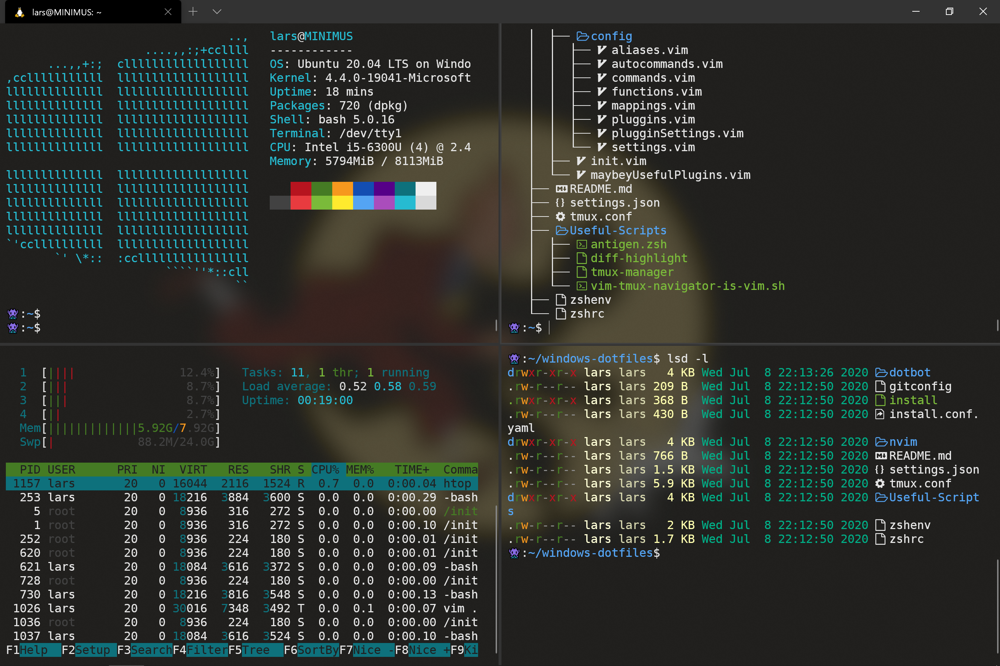
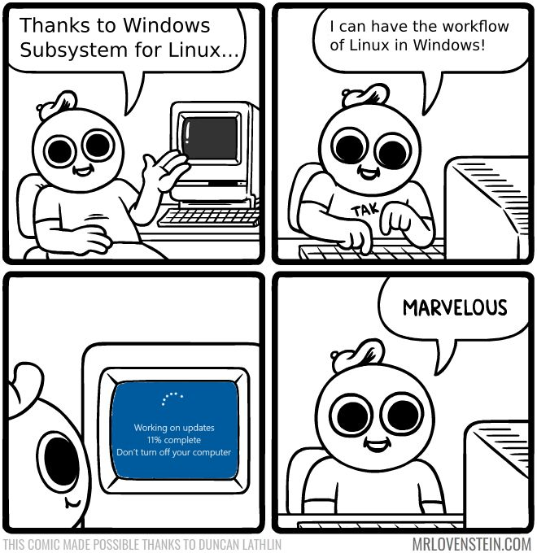

<h1 align="center">WSL Setup Dotfiles</h1>

<div align="center">

  []() 
  [](/LICENSE)

</div>

---

<p align="center">

</p>
<br> 

## 📝 Table of Contents
- [About](#about)
- [Getting Started](#getting_started)
- [Usage](#usage)
- [Authors](#authors)
- [Acknowledgments](#acknowledgement)


## 🧐 About <a name = "about"></a>
An (almost) automatic script for setting up a liveable bash terminal via Ubuntu in Windows Subsystem for Linux, as well as the home for (some of my) dotfiles. 

## 🏁 Getting Started <a name = "getting_started"></a>

First, Install DejaVu Sans Mono from nerd fonts, download [the Windows Compatible version](https://github.com/ryanoasis/nerd-fonts/blob/master/patched-fonts/DejaVuSansMono/Regular/complete/DejaVu%20Sans%20Mono%20Nerd%20Font%20Complete%20Mono%20Windows%20Compatible.ttf).

### Install WSL

If you do not already have `WSL`, follow these steps to install. First, download the Windows Terminal from the Microsoft Store. Open `Powershell`, and run the following commands:

```
Enable-WindowsOptionalFeature -Online -FeatureName Microsoft-Windows-Subsystem-Linux
Enable-WindowsOptionalFeature -Online -FeatureName VirtualMachinePlatform
```

Additionally, if you want to make WSL 2 your default architecture you can do so with this command:

```
wsl --set-default-version 2
```
_Note: Some people have had issues with this step, I'm looking to fix this and any feedback is much appreciated._  

After restarting, install Ubuntu from the [Microsoft Store](https://www.microsoft.com/pt-br/p/ubuntu/9nblggh4msv6?activetab=pivot:overviewtab) or through the terminal:

```
curl.exe -L -o ubuntu.appx https://aka.ms/wsl-ubuntu
```

Launch `Ubuntu.exe` from the _Start Menu_. You’ll be asked to enter a username and password.

### Install packages 

LSDeluxe:
Download the latest `.deb` package from the [release page](https://github.com/Peltoche/lsd/releases) and install it via:

```sh
sudo dpkg -i lsd_7.2.0_amd64.deb
```

### Set up dotfiles

Run these commands in the bash terminal:

```
cd 
git clone https://github.com/Sandbergo/wsl-setup-dotfiles
chmod 700 wsl-setup-dotfiles/ -R
cd wsl-setup-dotfiles
sudo apt update
./install.sh
./symlinks.sh
```

### Windows Terminal 

Copy the `settings.json` file to the appropriate location in your file system. 

### Remote - WSL

Install the [Remote - WSL](https://aka.ms/vscode-remote/download/wsl) extension in VSCode to get a better experience with `WSL`.


## 🎈 Usage <a name="usage"></a>
Fork the repository and track your own dotfiles.



## ✍️ Authors <a name = "authors"></a>
- Lars Sandberg [@Sandbergo](https://github.com/Sandbergo)


## 🎉 Acknowledgements <a name = "acknowledgement"></a>
- Trent Nicholson [@NICHTJ3](https://github.com/NICHTJ3)
- Samuel Ramos [@samuelramox](https://github.com/samuelramox)
